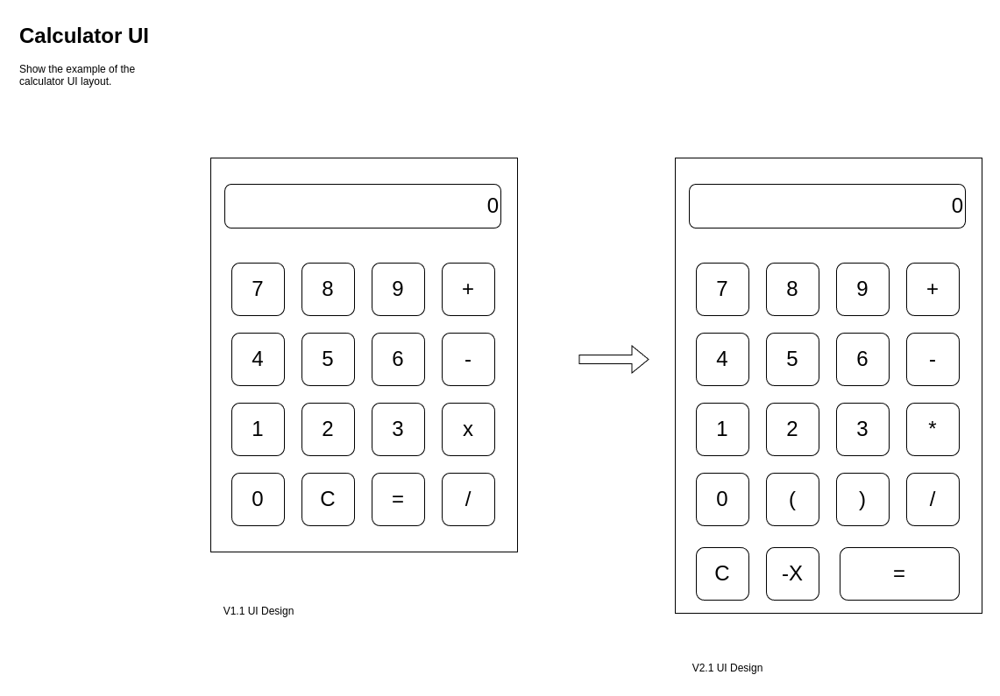
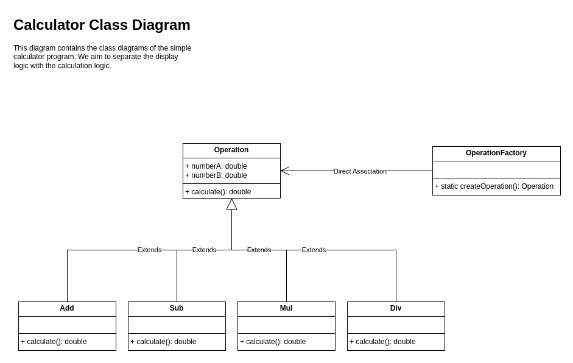

# QT-implementation

This document record the design and implementation of the "Simple_Calculator" using QT with C++.

## Installation of QT Environment

For the installation of QT environment, please refer to the official QT website. I have provided the following link for the Ubuntu user's reference:

https://www.geeksforgeeks.org/how-to-install-qt-creator-on-linux/

https://wiki.qt.io/Install_Qt_5_on_Ubuntu

## UI/UE

### UI

The UI design diagram is shown in the following diagram:

Currently, we use the `version 2.1` as the design.

### UE

In the previous document we have listed the "Test Cases" for the `INFIX-FULL` mode calculator, which represent the user experience part.

https://github.com/dcheng69/Simple_Calculator/tree/dev-QT-implementation

## Operation Class Design

### Class Diagram

### Design Principle

Employ Object Oriented design principle, I use `Operation` class as a base class, and all the other classes will extends this base class. This follows the **Abstraction** and **Inheritance** principles of the OOP.

Finally, I use the **simple factory design model** to finish the construction of the operation class, which simplify the arrangement of the code. This follows the **Polymorphism** principle of the OOP.

## Packaging & Release

https://chatgpt.com/share/8685a8b2-021a-4c08-949f-13142b488699