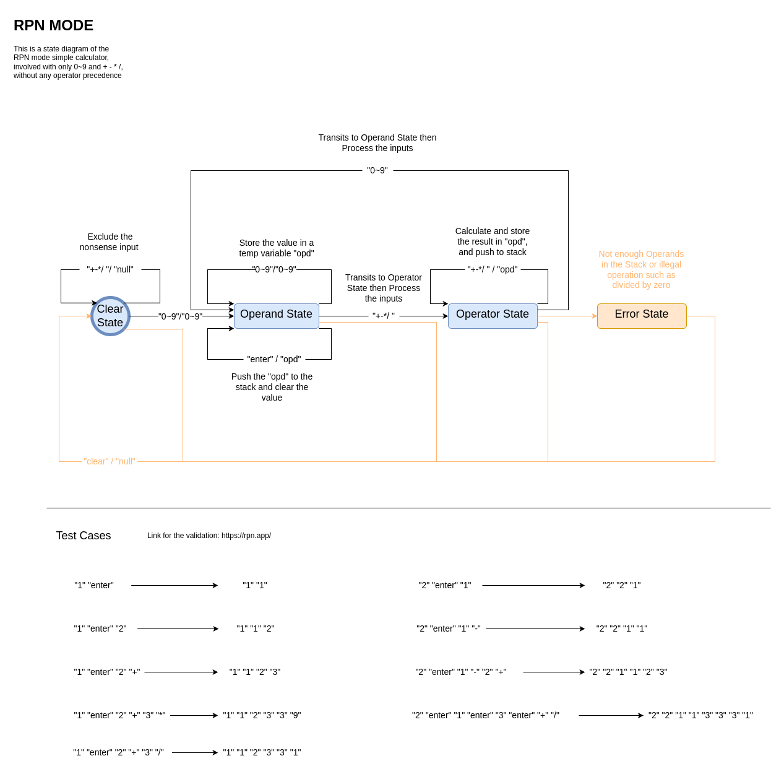

# Simple_Calculator

# Objective

The design process for creating a human computer interface will always proceed from informal requirements specifications, to implemented physical executable systems, in this project we will explore these transformation by following a classical pathway from requirements to implementation and testing.

We will focus on the key-press based user interfaces, with simple text-based output displays representing the digits corresponding to the input and output numbers.

We will be considering the design of three versions of simple calculators:

1. A **simple** 4-function calculator, which has buttons 0~9 and the function buttons {'+', '-', 'x', '/', '='}. This calculator will receive inputs from the user in normal "INFIX" mode, but without any operator precedence. 

   Given the following sequence of inputs {'5', '+', '3', 'x', '2', '='} the user will see '5', '3', '8', '2', and then the answer should be '16', not '11'.

2. A **simple** 4-function calculator, which operates in "RPN" mode. It has buttons 0~9, and the function buttons {'+', '-', 'x', '/'}, but instead of '=' it has an {'enter'} key.

   In this mode, the same calculator would be {'5', 'enter', '3', '+', '2', 'x'}, and the answer is '16'.

   

**Note:**

​	This project will serve as an introduction to the steps needed to proceed through all stages of the Requirements, Analysis, Design, Implementation and Testing phases. Thus, in order to simplify this process, no need to implement '**divide by zero**' error checking, nor any functionality for **entering negative numbers.** 

# State Chart

## RPM mode

### Test Cases

|                    Input                    |         Expected Output         |
| :-----------------------------------------: | :-----------------------------: |
|                 "1" "enter"                 |             "1" "1"             |
|               "1" "enter" "2"               |           "1" "1" "2"           |
|             "1" "enter" "2" "+"             |         "1" "1" "2" "3"         |
|             "2" "enter" "1" "-"             |         "2" "2" "1" "1"         |
|         "1" "enter" "2" "+" "3" "*"         |     "1" "1" "2" "3" "3" "9"     |
|         "1" "enter" "2" "+" "3" "/"         |     "1" "1" "2" "3" "3" "1"     |
| "2" "enter" "1" "enter" "3" "enter" "+" "/" | "2" "2" "1" "1" "3" "3" "3" "1" |

### State Chart

In the above state diagram, the error state and clear operation has been coloured in light orange because it is not required int his assignment.

**Note:**

The source file of this state chart is located in the res folder, can be edited with `draw.io` (https://app.diagrams.net/#).

# Interesting Implementations

## Language Parser

 For a terminal based program, we can consider equations (`eg: "4 + 4.5 - (34/(8*3+-3)`)") as an language, all we need to do is to define a parser to capture the grammar of the calculator. Just imagine the compiler but a simpler one!

To do this, we would need a parser generator(or compiler compiler), and Bison is just the tool for this purpose!

And you can find the usage of Bison and c/c++ in this GNU example link: https://www.gnu.org/software/bison/manual/html_node/Infix-Calc.html, in which the calculator evaluates arithmetic expressions written in infix notation. 

## Reference

1. https://en.wikipedia.org/wiki/GNU_Bison
2. https://www.gnu.org/software/bison/manual/html_node/Infix-Calc.html
3. https://en.wikipedia.org/wiki/Compiler-compiler